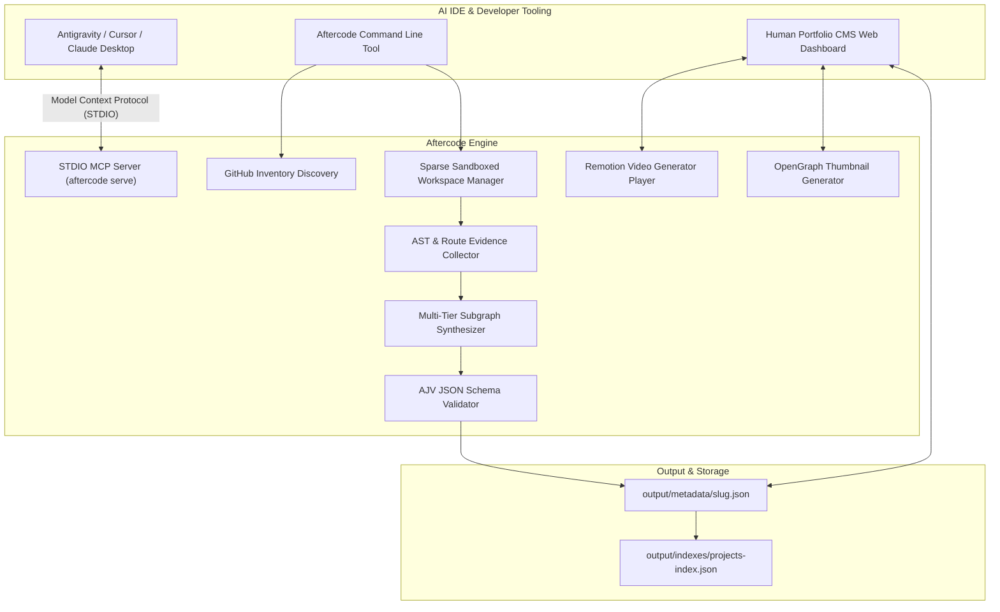

# ⚡ Aftercode

> **Autonomous Repository Analysis, Multi-Tier Architecture Engine & Visual Portfolio CMS for AI IDEs**

[](https://www.npmjs.com/package/aftercode)
[](https://opensource.org/licenses/MIT)
[](https://github.com/Sameer-Bagul/aftercode)
[](https://modelcontextprotocol.io)

**Aftercode** is an open-source developer engine, native **Model Context Protocol (MCP)** server, and visual **Human Portfolio CMS Web UI Dashboard** that automatically discovers, analyzes, classifies, synthesizes, and indexes GitHub repositories.

Designed to power AI IDEs like **Antigravity**, **Cursor**, **Claude Desktop**, and **Windsurf**, Aftercode transforms raw source code into schema-validated metadata, technical accomplishments, **multi-tier Mermaid subgraph architecture diagrams**, **OpenGraph thumbnails**, and **Remotion programmatic MP4 video reels**.

---

## ✨ Key Features

* **🎨 Minimalist Fruity Light Theme Web UI**: Interactive dashboard built with React 18, Vite, and fresh fruity styling (🍑 Peach, 🍈 Mint, 🫐 Lavender, 🍋 Lemon, 🫐 Sky Blue).
* **🎬 Remotion Video Preview Player**: Built-in video player modal rendering 4-scene animated video reels (Hero Intro, API Endpoint Matrix, Architecture Topologies, Tech Stack Outro).
* **🖼️ OpenGraph Thumbnail Generator**: Dynamically renders 1200x630 visual preview cards with tech stack badges and topology metrics.
* **⚡ Native MCP Server (`aftercode serve`)**: Connect directly to Antigravity, Cursor, or Claude Desktop via standard STDIO Model Context Protocol.
* **🛡️ Selective Sparse Sandboxing**: Uses `git clone --depth 1 --filter=blob:none --sparse` to download source files while skipping gigabytes of binary model weights (`.onnx`, `.bin`, `.pt`) and media archives.
* **📊 Multi-Tier Mermaid Subgraph Diagrams**: Automatically generates 5-tier architecture diagrams dividing topologies into `ClientTier`, `APITier`, `ServiceTier`, `DataEngineTier`, and `InfraTier`.
* **🔍 AST & Framework Detector**: Scans imports, route patterns (`GET /health`, `POST /tts`), package manifests, Dockerfiles, and ORM schemas to extract exact tech stacks.
* **⚡ AI Token Safety Guard**: Enforces token safety budgets (`truncateToTokenBudget`) and 20s timeouts with seamless deep heuristic fallbacks.
* **🚫 Zero-Emoji Sanitization**: Automated recursive sanitizer ensures clean, professional output across all metadata text fields.
* **🔒 Human Override Protection**: Preserves manually verified fields (`manuallyVerified: true`) across analysis runs.

---

## 🏗️ System Architecture



---

## ⚡ Exact Commands to Run Aftercode

### 1. Launch the Human Portfolio Web UI Dashboard

To open the interactive visual web application in your browser:

```bash
# Syncs output metadata and launches the Vite React Web Dashboard at http://localhost:5173
npm run ui:dev
```

### 2. Run CLI Commands

```bash
# Discover all public & private GitHub repositories for a user
npx aftercode discover Sameer-Bagul

# Process single repository
npx aftercode process athena-end-to-end-ai-agent

# Process entire repository queue
npx aftercode process all

# Validate output JSON files against AJV schema
npx aftercode validate

# Rebuild project catalog index files
npx aftercode rebuild
```

### 3. Build & Preview Production UI Bundle

```bash
# Build production bundle for the Web UI
npm run ui:build

# Preview compiled production build
npm --prefix ui run preview
```

---

## 🔌 Connecting to AI IDEs (Antigravity, Cursor, Claude Desktop)

Add **Aftercode** to your IDE's MCP configuration file (e.g. `.agents/mcp_config.json` or `claude_desktop_config.json`):

```json
{
  "mcpServers": {
    "aftercode": {
      "command": "node",
      "args": ["./dist/cli/bin.js", "serve"],
      "env": {
        "GITHUB_TOKEN": "${GITHUB_TOKEN}"
      }
    }
  }
}
```


### Available MCP Tools

* `aftercode_discover_repositories`: Discover repos for any username.
* `aftercode_analyze_repository`: Perform deep AST analysis and generate multi-tier Mermaid architecture diagrams.
* `aftercode_validate_metadata`: Validate metadata against official AJV schema.
* `aftercode_get_catalog_summary`: Get catalog overview across output metadata.

---

## 🛠️ Environment Variables

Copy `.env.example` to `.env`:

```bash
# Optional: GitHub PAT for 5,000 requests/hr rate limits & private repo access
GITHUB_TOKEN=ghp_your_personal_access_token

# Optional: Gemini / OpenAI API Key for LLM multi-pass synthesis
GEMINI_API_KEY=your_api_key
ENABLE_AI_LLM_SYNTHESIS=true
```

---

## 📄 License

[MIT License](LICENSE) © 2026 Sameer Bagul & Aftercode Contributors.
